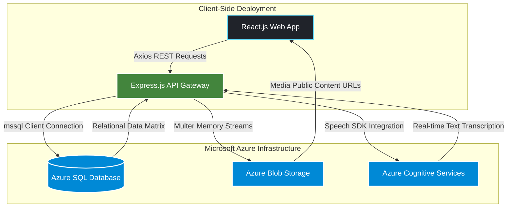

# ⚜️ ScoutPuls — Full-Stack Cloud Scout Management Platform

[](https://reactjs.org/)
[](https://nodejs.org/)
[](https://azure.microsoft.com/)
[](https://tailwindcss.com/)

**ScoutPuls** is a cloud-hosted scout troop management platform designed to help scout leaders efficiently manage scouts, track badge progress, administer training programs, and publish announcements via voice — all driven through a unified web interface.

---

## 📸 UI Screenshots & Workspace

### 📊 Platform Dashboards & Voice Hub
<table align="center">
  <tr>
    <td align="center" width="50%">
      
      <br><sub><b>1. Leader Control Panel</b></sub>
    </td>
    <td align="center" width="50%">
      
      <br><sub><b>2. Badge & Award System</b></sub>
    </td>
  </tr>
</table>
<table align="center">
  <tr>
    <td align="center" width="25%">
      
      <br><sub><b>3. AI Voice News Publisher</b></sub>
    </td>
    <td align="center" width="25%">
      
      <br><sub><b>4. Personalized Scout View</b></sub>
    </td>
  </tr>
</table>

---

## ✨ Core Feature Pipeline

### 🧑‍🤝‍🧑 Scout Management & Tracking
- **Enrollment Pipeline:** Register new scouts along with profile photo uploads managed by automated cloud storage handling.
- **Roster Overview:** Group, filter, and view active scouts by troop numbers, accompanied by their earned badges.
- **Attendance Registry:** Real-time state updates for tracking scout attendance status (*Present / Absent*).

### 🏅 Badge & Award System
- **National Catalog:** Full data access to the Sri Lanka Scout Badge collection.
- **Dynamic Awarding:** Instantly assign earned badges to specific scout profiles via a cross-reference junction table.
- **Media Customization:** Modify badge metadata and upload custom icon representations securely.

### 📚 Program Administration
- **Syllabus Mapping:** Oversee multiple distinct scouting tracks (Cub, Junior, Senior, Rover).
- **Resource Repository:** Edit core descriptions and upload official program cover graphics alongside reference handbook PDF files.

### 📢 AI-Powered Voice News Publisher
- **Browser Audio Capture:** Record voice announcements directly from the dashboard interface.
- **Cognitive Transcription:** Seamlessly process audio binaries utilizing the **Azure Cognitive Services Speech-to-Text SDK**.
- **Automated Feed Injection:** Transcribe and publish spoken announcements straight into the interactive public News feed.

---

## 🏗️ System Architecture



---

## 🛠️ Tech Stack Matrix

### Frontend (Client Core)

* **Framework:** React.js (v19) combined with Vite for high-speed module compilation.
* **Styling Architecture:** Tailwind CSS (v3) enabling utility-first fluid dashboard layouts.
* **Data Integration:** Axios HTTP client handling decoupled microservice requests.

### Backend & Storage Services

* **Runtime Environment:** Node.js paired with the Express.js REST routing framework.
* **Relational Storage:** Azure SQL Database linked via native `mssql` client pools.
* **Object Storage Bucket:** Azure Blob Storage hosting secure profile graphics, vector badge elements, and text documents.
* **Speech Processing:** Microsoft Cognitive Services Speech SDK executing local-to-cloud audio transcriptions.

---

## 🗄️ Database Schema (Azure SQL Relational Mapping)

| Table Target | Structured Column Mappings |
| --- | --- |
| **`Scouts`** | `ScoutID` (PK), `Name`, `TroopNo`, `ProfileImageUrl`, `Status`, `CreatedAt` |
| **`Badges`** | `BadgeID` (PK), `BadgeName`, `Description`, `Category`, `IconUrl` |
| **`ScoutBadges`** | `ScoutID` (FK), `BadgeID` (FK) *[Many-to-Many Bridge / Junction Table]* |
| **`Programs`** | `ProgramID` (PK), `Name`, `AgeGroup`, `Description`, `ImageUrl`, `FileUrl`, `Syllabus` (JSON String) |
| **`News`** | `id` (PK), `title`, `content`, `created_at` |

---

## 📡 Primary Endpoints (REST API)

### Scout & Resource Interfaces (`/api/scouts`)

* `GET /` — Fetch all enrolled scouts paired with their earned badge objects.
* `POST /` — Commit a new scout enrollment form containing binary media files.
* `PUT /:id/status` — Modify attendance tracking metrics for a targeted scout.
* `POST /award` — Bind a specific badge identity to a target scout.
* `PUT /badges/:id` — Overwrite descriptive fields or icons within the master badge list.
* `PUT /programs/:id` — Update curriculum data arrays, cover images, or PDF handbooks.

### AI Speech & Feed Routing (`/api/news`)

* `GET /` — Retrieve published text announcements sorted chronologically.
* `POST /voice-publish` — Pipeline audio binaries directly into Azure Cognitive engines, parse strings, and save the resultant text block.

---

## 📂 Structural Codebase Breakdown

```
ScoutPuls/
├── src/
│   ├── components/       # Interface units (Sidebar, ScoutCard, EnrollForm)
│   ├── dashboards/       # Segmented control layouts (Leader, Scout, News Views)
│   ├── layout/           # Global application viewport and navbar wrappers
│   ├── UI/               # Reusable presentation nodes (Modals, Custom Rows)
│   └── VoiceEngine/      # Audio capture handlers (VoiceNewsPublisher)
└── package.json          # Node modules compilation checklist

```

---

## ⚙️ Local Development Engine Configuration

### 1. Module Deployment

Clone and open the context directory on your workspace. Ingest necessary dependencies:

```bash
npm install

```

### 2. Environment Matrix Settings

Formulate a secure configurations file (`.env`) in the root directory targeting your cloud instances:

```env
DB_USER=your_azure_sql_username
DB_PASSWORD=your_azure_sql_password
DB_SERVER=your_scoutpuls_server.database.windows.net
DB_DATABASE=your_database_name

AZURE_STORAGE_CONNECTION_STRING=your_blob_storage_connection_string
AZURE_SPEECH_KEY=your_cognitive_speech_subscription_key
AZURE_SPEECH_REGION=southeastasia

```

### 3. Application Execution

Fire up the backend microservice engine:

```bash
npm start

